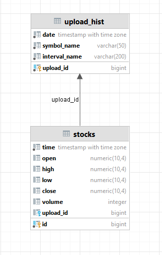
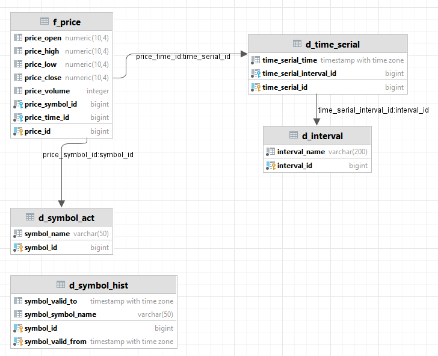
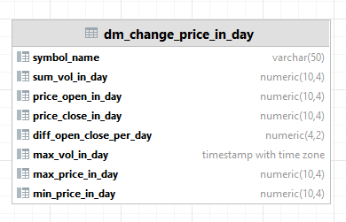

# Анализ рынка валют

### Общая задача: 
Ссоздать ETL-процесс формирования витрин данных для анализа изменений курса валют(акций).

Источники информации: https://www.alphavantage.co/

## Решение.

Разработаны скрипты загрузки данных в 2-х режимах:
- Инициализирующий – загрузка полного слепка данных источника
- Инкрементальный – загрузка дельты данных за прошедшие сутки

Организована структуру хранения данных:
- Сырой слой данных
- Промежуточный слой
- Слой витрин

В качестве результата работы программного продукта написан скрипт, который формирует витрину данных следующего содержания:
- Суррогатный ключ категории
- Название валюты
- Суммарный объем торгов за последние сутки
- Курс валюты на момент открытия торгов для данных суток
- Курс валюты на момент закрытия торгов для данных суток
- Разница(в %) курса с момента открытия до момента закрытия торгов для данных суток
- Минимальный временной интервал, на котором был зафиксирован самый крупный объем торгов для данных суток
- Минимальный временной интервал, на котором был зафиксирован максимальный курс для данных суток
- Минимальный временной интервал, на котором был зафиксирован минимальный курс торгов для данных суток

### Используемый стек.
При выборе используемого стека, для разработки ETL процесса, учитывались такие характеристики и требования, как:
- распространенность и популярность, так как это может повлиять на цену дальнейшего использования и сопровождения;
- адекватность применения инструментов и технологий к области решения ими задач;
- легкость переносимости и применения решения;
- простота применения, настройки и разработки.

Необходимые технологический стек, для разработки:
- СУБД, для хранения витрины данных;
- оркестратор ETL-пайплайна;
- система автоматизации развёртывания и управления разрабатываемого решения;
- язык программирования и фреймворки, для доступа к API и разработки ETL-пайплайна обработки данных;
- система визуализации данных.

Выбранный стек технологий:
- СУБД Postgresql;
- Airflow;
- Python(..);
- Metabase.

### Проектирование DWH.
В следствии постановки задачи в проектировании хранилища данных использован подход по Инмону с центральным слоем.

Используемы слои обработки данных:
- Операционный слой первичных данных (staging).
- Слой детальных интегрированных данных(ods).
- Витрина данных(cdm).

### Модель данных
Слой staging, трансформированных сырых данных:

Центральный слой:

Слой витрин:

Порядок загрузки объектов:
- Справочники
- Измерения
- Факты

Правила трансформации данных

Проектирование системы восстановления на основе требований
Добавить перед загрузкой каждой таблицы дополнительный шаг проверки. Это необходимое действие, которое позволит пропускать уже загруженные объекты.
Добавить после загрузки каждой таблицы дополнительный шаг по сохранению статуса загрузки. Так удастся сохранить статусы для уже загруженных таблиц.

ETL-пайплайн:
- выполнение через API запроса на выгрузку файлов с данными на диск;
- обработка файла: трансформация в табличный вид методами Python;
- загрузка табличных данных в таблицы staging-слоя
- обновление таблиц измерений в слое витрин
- обновление таблиц фактов в слое витрин
- в случае успешной загрузки батча с данными — обновление таблицы mart.load_history с метаданными.

