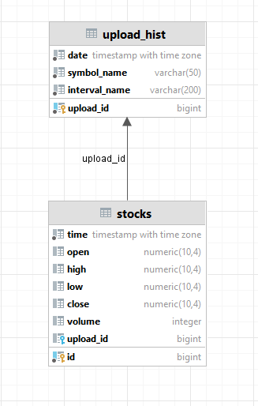
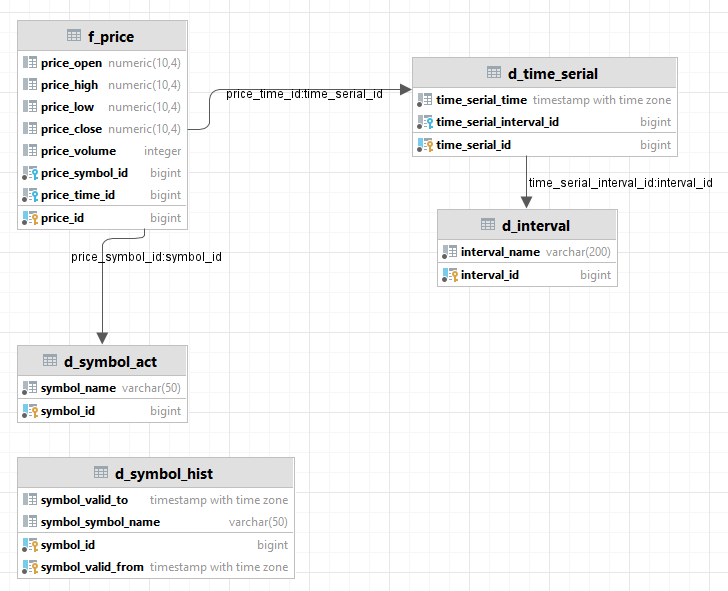
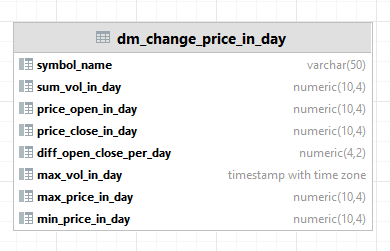

# Используемый стек.
  При выборе используемого стека, для разработки ETL процесса, учитывались такие характеристики и требования, как:
  - распространенность и популярность, так как это может повлиять на цену дальнейшего использования и сопровождения;
  - адекватность применения инструментов и технологий к области решения ими задач; 
  - легкость переносимости и применения решения;
  - простота применения, настройки и разработки.

  Необходимые технологический стек, для разработки:
  - СУБД, для хранения витрины данных;
  - оркестратор ETL-пайплайна;
  - система автоматизации развёртывания и управления разрабатываемого решения;
  - язык программирования и фреймворки, для доступа к API и разработки ETL-пайплайна обработки данных;
  - система визуализации данных.

  Выбранный стек технологий:
   - СУБД Postgresql;
   - Airflow;
   - Python(..);
   - Metabase.

# Проектирование DWH.
  В следствии постановки задачи в проектировании хранилища данных использован подход по Инмону с центральным слоем.

  Используемы слои обработки данных:
  - Операционный слой первичных данных (staging). 
  - Слой детальных интегрированных данных(ods).
  - Витрина данных(cdm).

# Модель данных
  Слой staging, трансформированных сырых данных:

  Центральный слой:

  
  Слой витрин: 

Правила трансформации данных

Порядок загрузки объектов

Справочники
Измерения
Факты

Проектирование системы восстановления на основе требований
Добавить перед загрузкой каждой таблицы дополнительный шаг проверки. Это необходимое действие, которое позволит пропускать уже загруженные объекты.
Добавить после загрузки каждой таблицы дополнительный шаг по сохранению статуса загрузки. Так удастся сохранить статусы для уже загруженных таблиц.

ETL-пайплайн
выполнение через API запроса на выгрузку файлов с данными на диск;
обработка файла: трансформация в табличный вид методами Python;
 - загрузка табличных данных в таблицы staging-слоя(паралельно?):
 - обновление таблиц измерений в слое витрин(паралельно?):
 - обновление таблиц фактов в слое витрин(паралельно?):
в случае успешной загрузки батча с данными — обновление таблицы mart.load_history с метаданными.

SCD4 for symbol!

контроля качества данных
технические
В технических требованиях к данным говорится только про характеристику сущностей, не про содержание.
именование файлов

бизнес-требования
Бизнес-требования, наоборот, связаны с содержанием сущностей

Технические требования проверяют по техническим же метаданным, а бизнес-требования — в основном по самим данным, но иногда с помощью бизнес-метаданных.

Технические метаданные раскрывают свойства объектов БД: местоположение, дату создания, имя, размер, допустимы ли значения NULL и т. д. Пример использования технических метаданных: проверка имён и количества файлов для импорта перед загрузкой данных в хранилище.

Бизнес-метаданные дают предметный контекст — скажем, они могут описать таблицу с непонятным названием вроде Table 1. Согласитесь, неясно, какие данные она содержит. Бизнес-метаданными в таком случае может быть модель данных, в которой указано, что в Table 1 собрана информация о постоянных клиентах. Пример может показаться надуманным, но на самом деле такое решение часто встречается. Многие компании с помощью шифровки защищают свои разработки от плагиата.

По метаданным проверяют соответствие данных требованиям, то есть их качество. Поэтому качество данных, подобно требованиям и метаданным, тоже делят на техническое и бизнес-качество данных.
Технические проверки данных — основные. Они нужны, чтобы снизить операционные риски — к примеру, не допустить ошибок во время загрузки и обработки данных. Благодаря проверкам технического качества инженеры реже переделывают свою работу, а коллеги могут избежать пауз в рабочем процессе.
Вот примеры технических проверок:
  Проверить что в папке есть файлы по шаблону
  Проверить что файлы не пустые
  Сверить загруженные данные с типом указанным в модели
  Инженер данные проверяет корректность внешних ключей так как обычно такие проверки отключают при загрузке 

Бизнес-качество данных
Если вы проверяете сами данные, а не их свойства, значит, вы проводите проверку бизнес-качества. 
проверка даты
проверка цены
лимиты: мин макс

Система проверок для вашего ETL-процесса
Для вашей учебной задачи подойдёт кастомная система контроля качества данных из трёх проверок. Например, с такой структурой:
Первый модуль — правила на основе трёх требований от коллег;
Второй модуль — скрипты выполнения трёх проверок;
Третий модуль — таблица dq_checks_results с результатами трёх проверок.
Какую бы систему контроля качества данных ни выбрала компания: пакетную, с открытым кодом или собственной разработки — инженеру данных нужно её настроить. Скоро вы приступите к разработке автопроверок для своей задачи, но сначала повторим главное из этой темы.